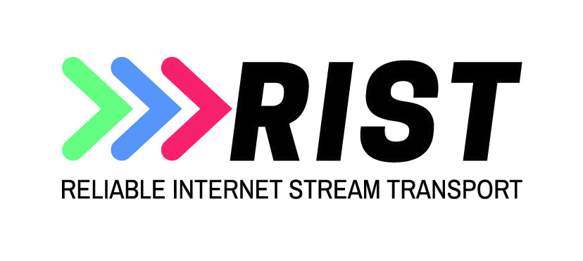
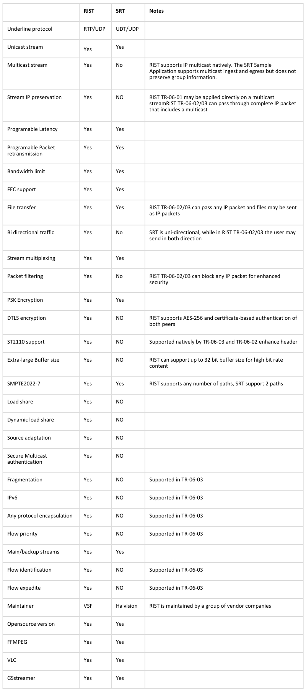

# libRIST

A library that can be used to easily add the RIST protocol to your application.

This code was written to comply with the Video Services Forum (VSF) Technical Recommendations TR-06-1 and TR-06-2. The protocol goes by the codename "RIST"

The canonical repository URL for this repo is https://code.videolan.org/rist/librist

This project is partially funded by the SipRadius LLC.

## Goal and Features

The goal of this project is to provide a RIST library for **most platforms**.

### Supported Standards

- **VSF TR-06-1** (Simple Profile) - Full support
- **VSF TR-06-2** (Main Profile) - Full support including:
  - PSK Encryption (AES-128 and AES-256)
  - SRP (Secure Remote Password) passphrase exchange
  - Bidirectional connection initiation
  - Multipath support (load balanced or redundant link bonding)
  - One-to-many distribution (media server mode)
  - Multiplexing and TUN interface support
  - Null packet deletion/suppression

### Additional Features

- YAML configuration file support for ristsender/ristreceiver
- Prometheus metrics exporter with OpenMetrics format
- MPEG-TS null packet suppression byte tracking
- Differentiated bandwidth statistics (normal/retry/rejected traffic)
- Session timeout API and callbacks
- Ephemeral listening ports
- Cross-platform TUN interface support in the library (macOS utun, Linux /dev/net/tun, Windows stub)
- `data_fd` forwarding API: attach any file descriptor (socket, FIFO, TUN fd) and let librist handle the data path

## Dependencies

None. This library has no external runtime dependencies on any OS other than normal core OS libraries.

## License

**libRIST** is released under a very liberal license, a contrario from the other VideoLAN projects, so that it can be embedded anywhere, including non-open-source software; or even drivers, to allow the creation of hybrid decoders.

The reasoning behind this decision is the same as for libvorbis, see [RMS on vorbis](https://lwn.net/2001/0301/a/rms-ov-license.php3).

## Library sweet spot (optimal use cases with current defaults)

- Buffer sizes from 50 ms to 30 seconds
- Networks with round trip times from 0ms to 5000ms
- Bitrates from 0 to 1 Gbps
- Packet size should be kept under the path's MTU (typically 1500). The library does not support packet fragmentation.
- Bi-directional communication available (not one-way systems like satellite)

If you have an application that needs to operate outside the sweet spot described above, you will need to modify some constants in the rist-private.h header and/or use some of the more obscure API calls to fine tune the library for your use case. The library can overcome all the limitations above by fine-tuning with the exception of packet fragmentation which will be addressed as a feature enhancement in the future.

# Roadmap

### Completed

- Complete C implementation of the RIST protocol
- Stable and documented public API
- VSF TR-06-1 (Simple Profile) full compliance
- VSF TR-06-2 (Main Profile) full compliance
- Cross-platform support (Linux, macOS, Windows, FreeBSD)
- PSK encryption and SRP passphrase exchange
- Multipath and multiplexing support
- Prometheus metrics integration

### In Progress

- Improve C code base with [various tweaks](https://code.videolan.org/rist/librist/wikis/to-do)
- Expanded platform testing and optimization
- Language bindings and wrappers

### Planned

- VSF TR-06-4 Part 4 - Decoder Synchronization API
- VSF TR-06-2 (Advanced Profile)

# Tools

The library includes several command-line utilities:

- **ristsender** - RIST sender application
- **ristreceiver** - RIST receiver application
- **rist2rist** - RIST relay/proxy application
- **udp2udp** - UDP relay application
- **risttunnel** - Point-to-point IP tunnel over RIST (bidirectional, ARQ, crypto)
- **prometheus-exporter** - Prometheus metrics endpoint (when built with libmicrohttpd)

All tools support YAML configuration files for easier deployment.

# Contribute

Currently, we are looking for help from:
- C developers,
- asm developers,
- platform-specific developers,
- testers.

Our contributions guidelines are quite strict. We want to build a coherent codebase to simplify maintenance and achieve the highest possible speed.

Notably, the codebase is in pure C and asm.

We are on Telegram, on the rist_users and librist_developers channels.

See the [contributions document](CONTRIBUTING.md).

## CLA

There is no CLA.

VideoLAN will only have the collective work rights.

## CoC

The [VideoLAN Code of Conduct](https://wiki.videolan.org/CoC) applies to this project.

# Compile using meson/ninja (linux, osx and windows-mingw)

1. Install [Meson](https://mesonbuild.com/) (0.51 or higher), [Ninja](https://ninja-build.org/)
2. Alternatively, use "pip3 install meson" and "pip3 install ninja" to install them
3. Run `mkdir build && cd build` to create a build directory and enter it
4. Run `meson ..` to configure meson, add `--default-library=static` if static linking is desired
5. Run `ninja` to compile

# Compile using meson/ninja (windows - Visual Studio 2019/2022)

1. Open a cmd window and type "pip3 install meson" to install meson through Python Package Index
2. Run "x64 Native Tools Command Prompt for VS 2019.exe" (or VS 2022)
3. cd to the folder where you downloaded or cloned the librist source code
4. Run the command "meson setup build --backend vs2019" (or vs2022)
5. Run the command "meson compile -C build"
6. The compiled library and the tools will be in the build and build/tools folders respectively
7. Alternatively, open librist.sln and build the applications manually if you prefer to use the VS IDE

# Build with Docker

1. Simply do a `docker build` on the Dockerfile in the 'common' subdirectory

# Install with HomeBrew on MacOS

1. Assuming HomeBrew is already setup, enter "brew install librist" in a terminal.
2. libRIST will be installed in /usr/local, except on Arm64-based Macs, where the root is /opt/homebrew. Make sure to have the bin folder (/usr/local/bin or /opt/homebrew/bin, respectively) in your PATH.

# Support

This project is partially funded by SipRadius LLC.

This company can provide support and integration help, should you need it.

# FAQ

## Why do you not improve SRT rather than starting a new project?

- Although SRT provides a similar solution, it is the result of the vision and design of a single company, Haivision, and it is maintained almost exclusively by Haivision paid developers. RIST on the other hand, was the collective design work of a large group of experts (companies) that have been providing packet recovery services for many years. From its conception, RIST has been based on clear and open standards. Just from SipRadius installations alone, top tier broadcasters have over 4000 RIST point-to-point links running 24/7h.

Here is a table of comparison of the two protocols:

## Is libRIST an acronym?

- Yes, libRIST stands for Library - Reliable Internet Stream Transport

## Can I help?

- Yes. See the [contributions document](CONTRIBUTING.md).

## I am not a developer. Can I help?

- Yes. We need testers, bug reporters, and documentation writers.

## What about the packet recovery patents?

- This code was written to comply with the Video Services Forum (VSF) Technical Recommendations TR-06-1 and TR-06-2 and as such is free of any patent royalty payments

## Will you care about <my_arch>? <my_os>?

- We do, but we don't have either the time or the knowledge. Therefore, patches and contributions welcome.

## How can I test it?

- We have included command line utilities for windows/linux/osx inside this project. They are compiled and placed into the tools folder under the build folder.

- The Wiki has good information on the use of these utilities https://code.videolan.org/rist/librist/-/wikis/LibRIST%20Documentation
